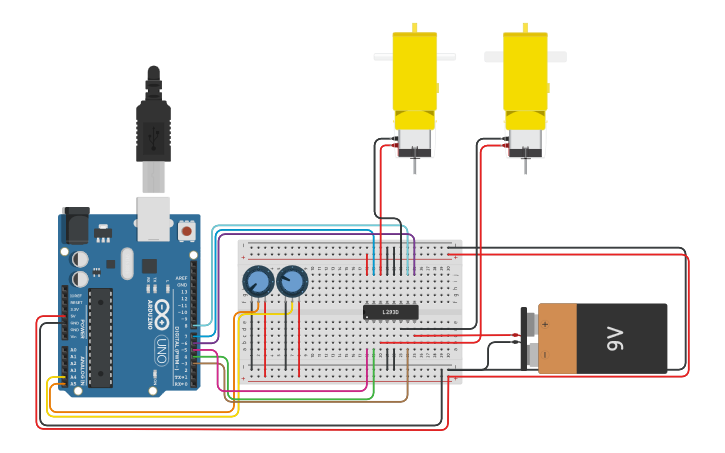

# CarTheory
## Preview

## External Links
[TinkerCad](https://www.tinkercad.com/things/5Qjc0Dvsi0b-car-theory)

## Description
The CarTheory circuit is an attempt of simulate a "bimotor" car.
The name is CarTheory because is only a theory with how the microprocessor must
control the motors, that is, not tested in practical!

Using the first potentiometer you can adjust the motors velocity and through
the second pot. it's possible set a direction(angle) for the car.
