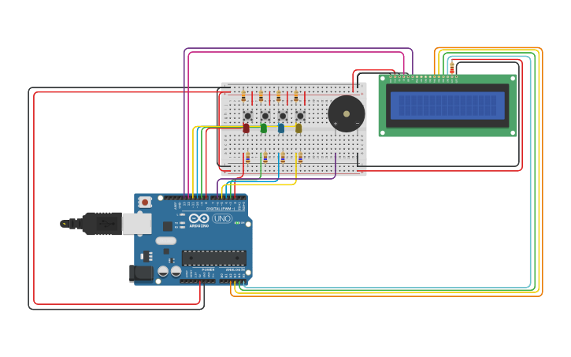

# MnemonicGame
This circuit simulates a popular memory game that player have hit the buttons
in the right order to win.

Here we have four buttons, each one with own color and own sound.

Access by: [TinkerCad](https://www.tinkercad.com/things/fk0JSL3ICDa-mnemonic-game)

## Preview

## Manual
When device boot, the lcd display prints "HI THERE!" and, in next line,
"HOW ARE YOU?". After that, the user is dropped to game menu.

### Menu
Use the **green** button to browser between menus. In each menu mode the
buttons take a speacial function, see the below table for more infos.

| MENU MODE | BUTTON RED(FUNCTION) | BUTTON GREEN(FUNCTION) | BUTTON BLUE(FUNCTION) | BUTTON YELLOW(FUNCTION) |
|-----------|----------------------|------------------------|-----------------------|-------------------------|
| PLAY      | Initialize game      | Switch menu mode       | Initialize game       | Initialize game         |
| SCORE     |          ---         | Switch menu mode       | See next high score   | See previous high score |
| GAME MODE |          ---         | Switch menu mode       | Set next game mode    | Set previous game mode  |

Note that the switch of the menu mode, high scores and game mode are circular,
that is, when rearch the first item the next item is the last and vice-versa.

#### Menu Play
Initialize the game when recive the signal. Challenge the player to play.

#### Menu Score
Display the 20 stored high scores in a decrease mode. 

### Menu Game Mode
Set a game mode. Each one defines how many rounds, heart points and players
have a play. Check the below table for view the data of each game mode.

| GAME_MODE      | ROUNDS              | HEART POINTS(for each player) | PLAYERS |
|----------------|---------------------|-------------------------------|---------|
| EASY           | 10                  | 3                             | 1       |
| MEDIUM         | 20                  | 3                             | 1       |
| HARD           | 30                  | 3                             | 1       |
| INFINITY       | GAME_ROUNDS_MAX(50) | 3                             | 1       |
| MULTIPLAYER 2X | GAME_ROUNDS_MAX     | 3                             | 2       |
| MULTIPLAYER 3X | GAME_ROUNDS_MAX     | 3                             | 3       |
| MULTIPLAYER 4X | GAME_ROUNDS_MAX     | 3                             | 4       |

## Game Play
When playing the game, the lcd display prints the player's name, hp and score.

Each player have your own led sequence. Every round the player's sequence
is showed only one time and increase one.
