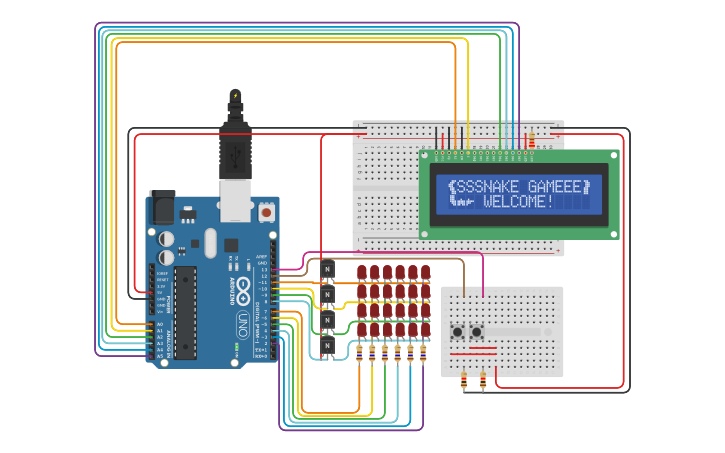

# SnakeGame!
## Preview

## Drescription
This circuit simulates the popular snake game.

Using a Led Matrix, this circuit displays the snake's body and the food for feed and make grow it!
However, due to the limitations of TinkerCad and the microcontroller ATmega328, the snake's body and the food have the same color.
For resolve this, in the playing mode, the LCD displays the current snake's direction, the counterclockwise and clockwise snake's direction.

Using the two able buttons, you can control the snake.
Pushing the left button make the snake turn in the counterclockwise direction
and pushing the right button make the snake turn in the clockwise.

Furthermore, the game is able to store scores and switching the game level.

See the below table of each game mode and a brief description about them for more data.
| (MAIN)GAME MODES | DESCRIPTION                                                                                                                                                              |
|------------------|--------------------------------------------------------------------------------------------------------------------------------------------------------------------------|
| BOOTING          | Just used in game initializing. When booting, the game displays a welcome message  with a simple animation of a snake showing it tongue through of a LCD display. |
| MENU             | As name say, it's the game menu. In this mode, the user is able to browser between the menu's tab, like SCORE, PLAY, LEVEL.                      |
| PLAYING          | The core play. Here that's the magic happens.                                                                                                                           |

| (MENU)GAME MODES | DESCRIPTION                                                                                                                                                                                                                                   |
|------------------|-----------------------------------------------------------------------------------------------------------------------------------------------------------------------------------------------------------------------------------------------|
| PLAY             | Using this menu mode, the player is able to initialize the game.                                                                                                                                                                              |
| SCORE            | Here, the player can see your scores. The greater twenty scores are stored and displayed in a crescent order.                                                                                                                           |
| LEVEL            | For now, this game have just one level. However, if had more than one level the player should be able to select the wish level. A level define how the game goes behave, but not much beyond that, now it only sets the player's hp. |

<i>*Note that the Menu modes are circular, that is, when rearched the last menu, the next is the first menu.
The last menu is LEVEL and the first is PLAY.</i>

The right and left push buttons have four function in all game:

- <b>Select the next game menu mode</b>
- <b>Activate a game menu action</b>
- <b>Turn the sanke in a clockwise direction</b>
- <b>Turn the snake in a counterclockwise direction</b>

See the follow table for more informations about the buttons functions in each menu and in the PLAYING mode
| BUTTON | MENU PLAY            | MENU SCORE           | MENU LEVEL           | PLAYING                                        |
|--------|----------------------|----------------------|----------------------|------------------------------------------------|
| RIGHT  | Start the game.      | See the next score   | Set the next level   | Turn the snake into clockwise direction        |
| LEFT   | Switch for next menu | Switch for next menu | Switch for next menu | Turn the snake into counterclockwise direction |
